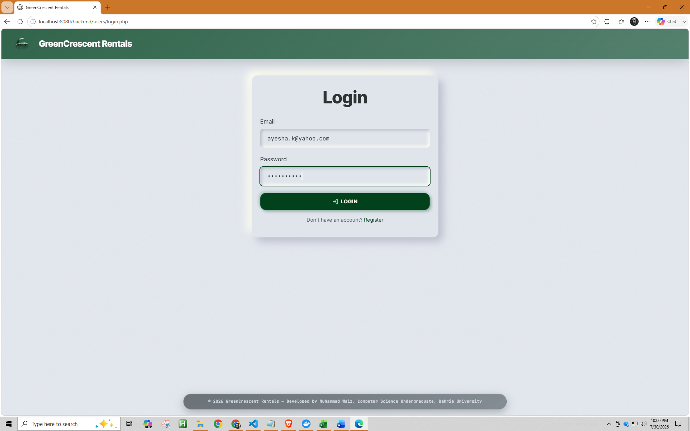
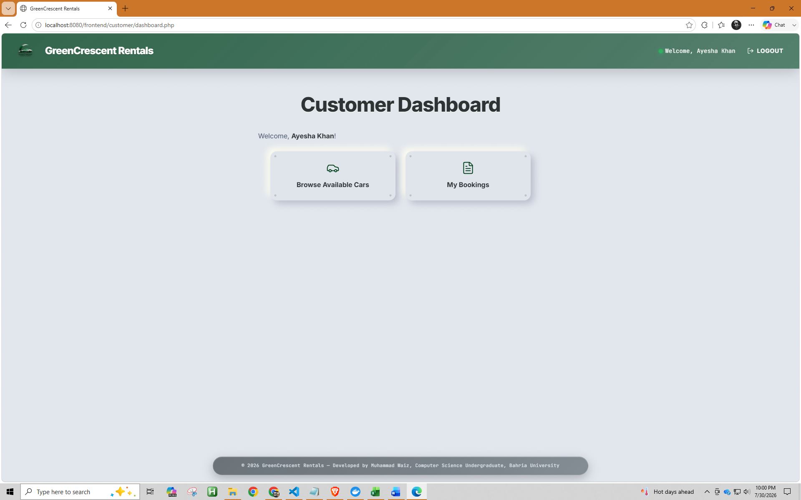
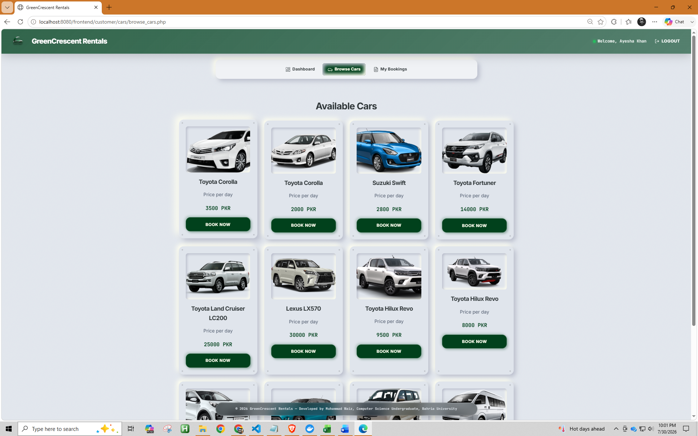
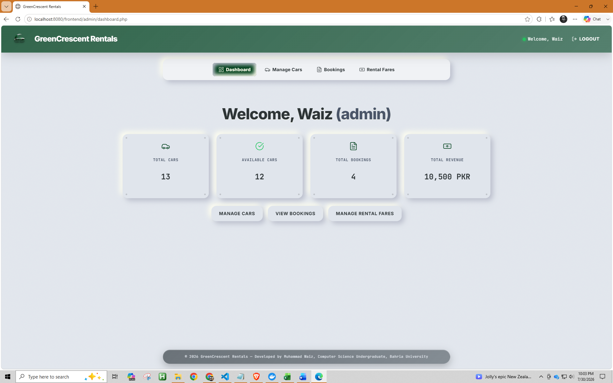
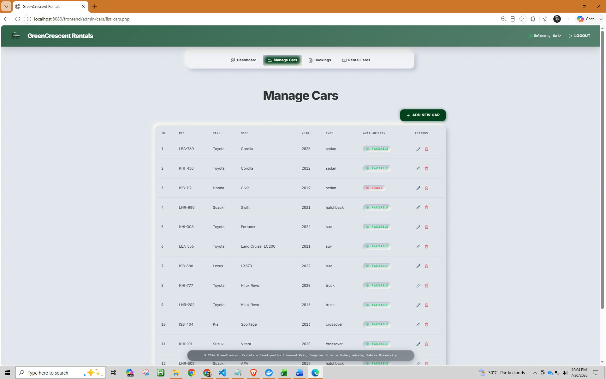
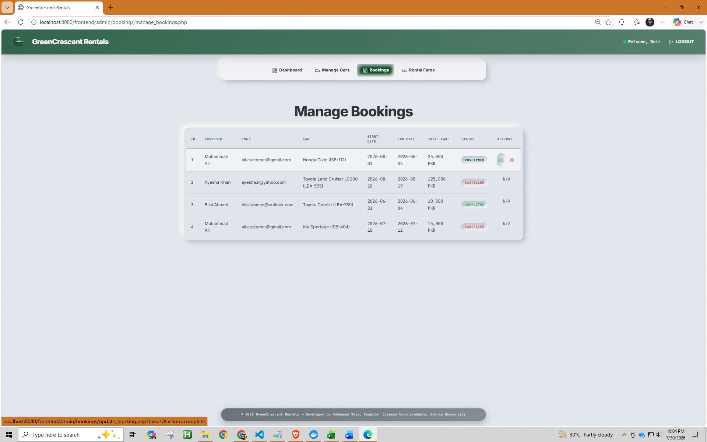

<div align="center">


# 🚗 GreenCrescent Rentals

### A Full-Stack Car Rental Management System

**PHP · MySQL · Docker** — a complete rental platform with customer booking management, administrator controls, vehicle management, and containerized deployment.

[](https://www.php.net/)
[](https://www.mysql.com/)
[](https://www.docker.com/)
[](https://httpd.apache.org/)
[](#-license)

</div>

---

## 📋 Table of Contents

- [Project Overview](#-project-overview)
- [Features](#-features)
- [User Roles](#-user-roles)
- [Database Design](#-database-design)
- [Tech Stack](#-tech-stack)
- [Local Development](#-local-development)
- [Folder Structure](#-folder-structure)
- [Installation](#-installation)
- [Database Setup](#-database-setup)
- [Default Login Credentials](#-default-login-credentials)
- [Screenshots](#-screenshots)
- [Future Improvements](#-future-improvements)
- [License](#-license)
- [Author](#-author)

---

## 🌿 Project Overview

**GreenCrescent Rentals** is a web-based car rental management system built to streamline vehicle rental operations through a single, centralized platform.

The system is organized around two core interfaces:

| Interface | Purpose |
|---|---|
| 🧑‍💼 **Customer Portal** | Browse available vehicles, create bookings, manage reservations, and track booking status |
| 🛠️ **Administrator Dashboard** | Manage vehicles, fares, bookings, and overall rental operations |

The project follows a structured backend/frontend separation, integrates with a MySQL database, and supports containerized deployment via Docker.

Originally developed as an academic project, it has since been refined with:

- ✨ Improved UI consistency
- 🗂️ Organized project structure
- 🧭 Clean navigation flow
- 🐳 Docker deployment support
- 📄 Production-oriented documentation

---

## ✨ Features

### 🧑‍💼 Customer Features

- User registration and authentication
- Personalized customer dashboard
- Browse available vehicles
- View detailed vehicle information
- Submit rental bookings
- View personal booking history
- Cancel bookings
- Track real-time booking status

### 🛠️ Administrator Features

- Secure admin authentication
- Centralized admin dashboard
- **Vehicle management**
  - Add vehicles
  - Edit vehicle information
  - Delete vehicles
  - View vehicle listings
- **Booking management**
  - View customer bookings
  - Update booking status
  - Manage rental requests
- **Fare management**
  - Add rental pricing
  - Update fare records
  - Maintain pricing information

### ⚙️ System Features

- Role-based access control
- Session-based authentication
- MySQL relational database
- Dynamic booking calculations
- Reusable frontend components
- Responsive interface
- Dockerized application deployment

---

## 👥 User Roles

### Customer

```
Register
   ↓
Login
   ↓
Browse Vehicles
   ↓
Create Booking
   ↓
Track / Manage Reservations
```

### Administrator

```
Login
   ↓
Access Dashboard
   ↓
Manage Vehicles
   ↓
Manage Bookings
   ↓
Manage Rental Fares
```

---

## 🗄️ Database Design

The project uses a relational **MySQL** database containing entities for:

- 👤 Users
- 🚘 Vehicles
- 📖 Bookings
- 💰 Fare Management

Database relationships and structure are documented in the entity-relationship diagram:

📎 [`docs/ER_diagram.png`](docs/ER_diagram.png)

---

## 🧰 Tech Stack

### Backend

| Technology | Purpose |
|---|---|
| 🐘 PHP 8.2 | Server-side application logic |
| 🗃️ MySQL | Database management |
| 🔌 MySQLi | Database communication |
| 🌐 Apache | Web server |

### Frontend

| Technology | Purpose |
|---|---|
| 📄 HTML5 | Page structure |
| 🎨 CSS3 | Styling and layouts |
| ⚡ JavaScript | Client-side interactions |

### Development & Deployment

| Technology | Purpose |
|---|---|
| 🐳 Docker | Application containerization |
| 🧩 Docker Compose | Multi-container orchestration |
| 🌐 Apache PHP Image | Web runtime environment |
| 🗄️ MySQL Docker Image | Database container |

---

## 💻 Local Development

Supported environments:

- 🐳 **Docker Compose** *(recommended)*
- 🧡 **XAMPP** (Apache + MySQL)

> Docker deployment allows the project to run without manually installing PHP, Apache, or MySQL on your machine.

---

## 📁 Folder Structure

The project follows a clear separation between application logic, frontend pages, database scripts, and deployment configuration.

```
GreenCrescent_Rentals
│
├── backend
│   │
│   ├── auth
│   │   ├── admin_guard.php
│   │   ├── customer_guard.php
│   │   └── session_init.php
│   │
│   ├── db
│   │   └── db_connect.php
│   │
│   └── users
│       ├── login.php
│       ├── logout.php
│       └── register.php
│
├── frontend
│   │
│   ├── admin
│   │   ├── bookings
│   │   │   ├── manage_bookings.php
│   │   │   ├── update_booking.php
│   │   │   └── view_bookings.php
│   │   │
│   │   ├── cars
│   │   │   ├── add_car.php
│   │   │   ├── delete_car.php
│   │   │   ├── edit_car.php
│   │   │   └── list_cars.php
│   │   │
│   │   ├── fares
│   │   │   ├── add_fare.php
│   │   │   └── manage_fares.php
│   │   │
│   │   ├── common
│   │   │   └── navbar.php
│   │   │
│   │   └── dashboard.php
│   │
│   ├── customer
│   │   ├── bookings
│   │   │   ├── book_car.php
│   │   │   ├── book_form.php
│   │   │   ├── cancel_booking.php
│   │   │   └── my_bookings.php
│   │   │
│   │   ├── cars
│   │   │   └── browse_cars.php
│   │   │
│   │   ├── dashboard.php
│   │   └── register.html
│   │
│   ├── common
│   │   ├── header.php
│   │   ├── navbar.php
│   │   └── footer.php
│   │
│   ├── css
│   │   └── style.css
│   │
│   └── images
│
├── sql
│   ├── green_crescent_schema.sql
│   └── sample_data.sql
│
├── docs
│   └── ER_diagram.png
│
├── Dockerfile
├── docker-compose.yml
├── .dockerignore
├── .gitignore
└── index.php
```

---

## 🚀 Installation

### Option 1 — Run Using Docker 🐳 *(Recommended)*

Docker provides a complete, self-contained environment including PHP, Apache, and the MySQL database.

**Prerequisites**

Install [Docker Desktop](https://www.docker.com/products/docker-desktop/), then verify:

```bash
docker --version
docker compose version
```

**Clone the repository**

```bash
git clone https://github.com/waizlab/GreenCrescent_Rentals.git
cd GreenCrescent_Rentals
```

**Start the application**

```bash
docker compose up --build
```

The application will be available at:

| Service | URL |
|---|---|
| 🌐 Frontend | `http://localhost:8080` |
| 🗄️ Database | `localhost:3307` |

**Stop the application**

```bash
docker compose down
```

**Reset the database completely**

If the database initialization needs to run again:

```bash
docker compose down -v
docker compose up --build
```

> This removes the existing MySQL volume and recreates the database from the SQL scripts.

---

### Option 2 — Run Using XAMPP 🧡

**Requirements**

- XAMPP
- PHP 8+
- MySQL

**Setup Steps**

1. Copy the `GreenCrescent_Rentals` project folder into `xampp/htdocs/`
2. Start **Apache** and **MySQL** from the XAMPP control panel
3. Create a database named `GreenCrescent_Rentals`
4. Import the schema:
   ```
   sql/green_crescent_schema.sql
   ```
5. *(Optional)* Import sample data:
   ```
   sql/sample_data.sql
   ```
6. Open the application:
   ```
   http://localhost/GreenCrescent_Rentals/
   ```

---

## 🗃️ Database Setup

The application uses **MySQL** as its database engine.

- **Database name:** `GreenCrescent_Rentals`

### Database Initialization

The Docker setup automatically executes `sql/green_crescent_schema.sql` during first database creation.

Sample records can optionally be loaded using `sql/sample_data.sql`.

### Database Configuration

Database connection settings are managed in:

```
backend/db/db_connect.php
```

For **Docker**, connection values are loaded via environment variables:

| Variable | Description |
|---|---|
| `DB_HOST` | Database host |
| `DB_USER` | Database username |
| `DB_PASSWORD` | Database password |
| `DB_NAME` | Database name |
| `DB_PORT` | Database port |

For local **XAMPP** usage, update these connection values according to your own MySQL configuration.

---

## 🔑 Default Login Credentials

### 🛠️ Administrator Account

| Field | Value |
|---|---|
| Email | `admin@greencrescent.com` |
| Password | `admin321` |

### 🧑‍💼 Customer Account

Customers can create their own accounts through:

```
frontend/customer/register.html
```

or by registering directly through the application interface.

---

## 🖼️ Screenshots

> Screenshots demonstrating the application interface are stored in `docs/screenshots/`.

```
docs/
│
├── ER_diagram.png
│
└── screenshots/
    ├── login.png
    ├── customer-dashboard.png
    ├── available_cars.png
    ├── admin-dashboard.png
    ├── vehicle-management.png
    └── booking-management.png
```

### Login Page


### Customer Dashboard


### Available Cars


### Admin Dashboard


### Vehicle Management


### Booking Management


---

## 🔮 Future Improvements

Planned enhancements for upcoming versions:

### 🔐 Security Enhancements

- Replace plain-text password storage with hashed passwords using `password_hash()` and `password_verify()`
- Move sensitive database credentials into environment configuration files

### 🧩 Application Improvements

- *(Add planned features here)*

---

## 📜 License

This project is licensed under the **MIT License**. See the [`LICENSE`](LICENSE) file for details.

---

## 👤 Author

**Muhammad Waiz**
Computer Science Undergraduate — Bahria University, Karachi Campus

[](https://github.com/waizlab)

<div align="center">

⭐ If you find this project useful, consider giving it a star on GitHub!

</div>
